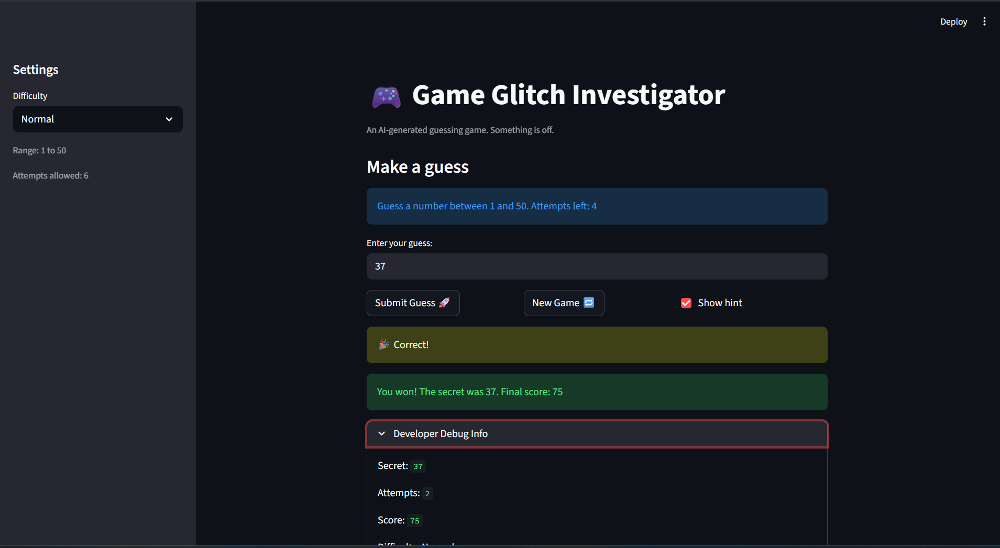
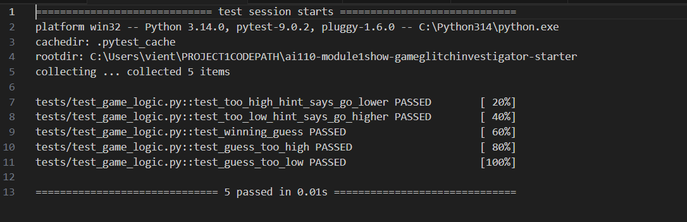

# 🎮 Game Glitch Investigator: The Impossible Guesser

## 🚨 The Situation

You asked an AI to build a simple "Number Guessing Game" using Streamlit.
It wrote the code, ran away, and now the game is unplayable. 

- You can't win.
- The hints lie to you.
- The secret number seems to have commitment issues.

## 🛠️ Setup

1. Install dependencies: `pip install -r requirements.txt`
2. Run the broken app: `python -m streamlit run app.py`

## 🕵️‍♂️ Your Mission

1. **Play the game.** Open the "Developer Debug Info" tab in the app to see the secret number. Try to win.
2. **Find the State Bug.** Why does the secret number change every time you click "Submit"? Ask ChatGPT: *"How do I keep a variable from resetting in Streamlit when I click a button?"*
3. **Fix the Logic.** The hints ("Higher/Lower") are wrong. Fix them.
4. **Refactor & Test.** - Move the logic into `logic_utils.py`.
   - Run `pytest` in your terminal.
   - Keep fixing until all tests pass!

## 📝 Document Your Experience

- [ ] Describe the game's purpose.
- The game sole purpose is for the user to guess the secret number. There are difficulty options from easy to hard that make the game more interesting. The user can choose to have hints on whether the current guess is higher or lower to the secret number. The faster the user guess a number, the higher the user points get.
- [ ] Detail which bugs you found.
- There was a wide range of bugs: The hints were opposite, you cannot reset new game, the range of the difficulty was wrong, the game did not handle edge cases of uesr input good enough, the number of attempts can go to negative, the scoring system was weird, sometime the secret number turn to a string,...
- [ ] Explain what fixes you applied.
- Fix the hints to be meaningful to guess the secret number, fix the diffulty range, allow the game to reset using new game button, handle edge cases of the user input,...

## 📸 Demo

- [ ] [Insert a screenshot of your fixed, winning game here]

## 🚀 Stretch Features

- [ ] [If you choose to complete Challenge 4, insert a screenshot of your Enhanced Game UI here]
